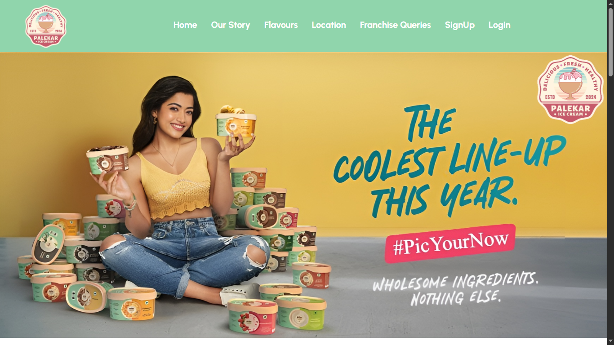
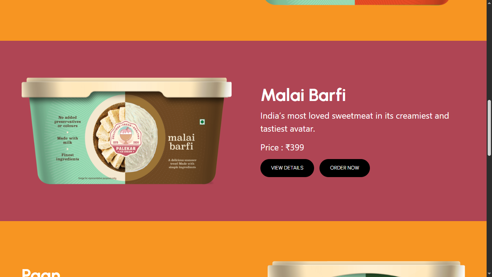
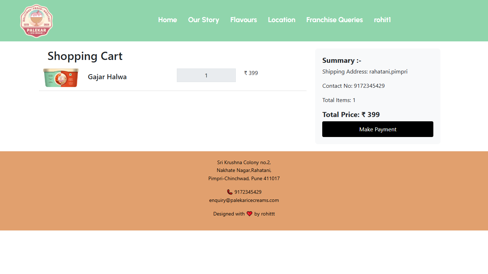
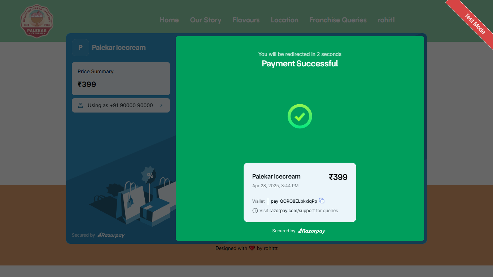

# 🍦 Palekar Ice-Cream

A complete **e-commerce web application** for ordering delicious ice-creams online!  
Built using **HTML, CSS, Bootstrap, JavaScript, MySQL, Python, Django** with **Razorpay payment integration** and **email order confirmation** functionality.

---

## 📸 Project Preview

---

## 🏠 Homepage Banner

---

## 📖 Our Story Section

---

## 🍦 Products Page

---

## 🧾 Product Description Page

---

## 🛒 Cart Page

---

## 🧾 Order History Page

---

## 💳 Payment Gateway Integration

---

## 💳 Payment Done

---

## 🚀 Features

- 🛒 Browse and order a wide range of ice-creams
- 💳 Secure online payment via **Razorpay**
- 📩 Receive order confirmation emails after placing an order
- 🧾 View order history
- 🖥️ Responsive design for all devices
- 🛡️ Secure user authentication (Login/Register)

---

## 🛠️ Tech Stack

| Technology | Usage |
|:---|:---|
| HTML | Structure |
| CSS | Styling |
| Bootstrap | Responsive Design |
| JavaScript | Frontend interactivity |
| Django | Backend development |
| MySQL | Database management |
| Razorpay | Payment Gateway |
| SMTP (Django Email Backend) | Sending Emails |

---

## 📂 Project Structure

## Key Folders and Files:

- **`env/`**: This directory contains the virtual environment for the project. It's used to isolate project dependencies.
- **`palekar_icecream/`**: This folder contains the main settings and configuration files for the Django project.
- **`iceapp/`**: The Django app that handles the functionality related to ice cream ordering, including models, views, and URLs.
- **`media/`**: All user-uploaded media files (e.g., images of ice cream flavors) are stored here.
- **`static/`**: Contains the static files (e.g., CSS, JS, images) used for the front end.
- **`templates/`**: HTML templates for rendering the user interface.
- **`db.sqlite3`**: If you're using SQLite, this is your database file. You may want to configure it for production or use another database in the future.
- **`manage.py`**: A utility script for managing various Django tasks like running the server or applying migrations.
- **`.gitignore`**: Specifies which files and directories should be ignored by Git, such as virtual environments or compiled Python files.
- **`README.md`**: The file you're currently editing, which contains project documentation.

